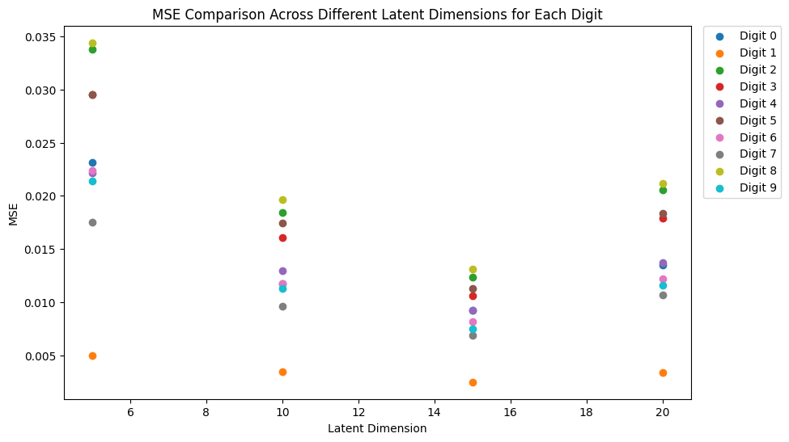
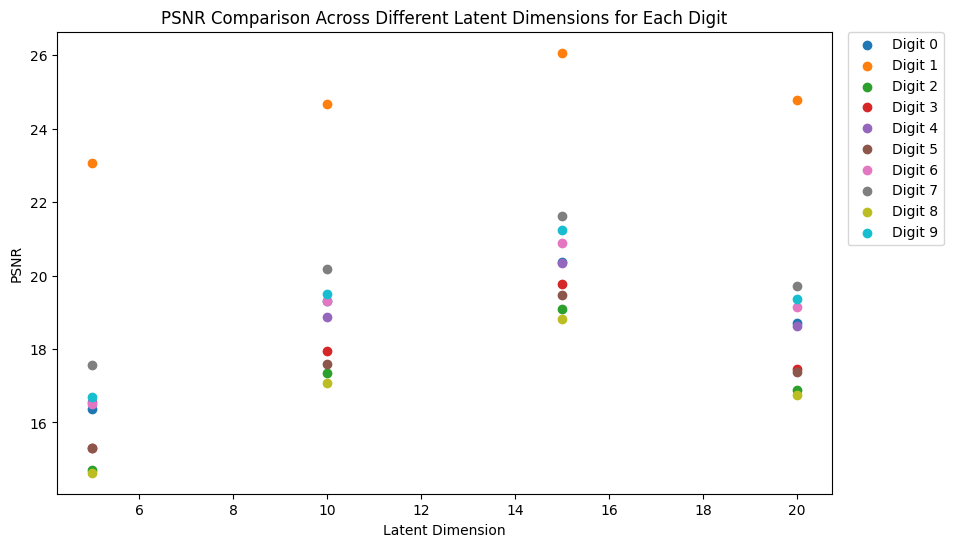

# DeepLearning-MNIST-VAE

## Optimal Latent Space Dimension for VAE Model

In the quest for the most effective Variational Autoencoder (VAE) model for digit reconstruction on the MNIST dataset, a comprehensive analysis was conducted to determine the optimal size of the latent space. Through meticulous experimentation with various latent dimensions, the goal was to find a balance between reconstruction accuracy and model complexity.

### Comparative Analysis of Latent Dimensions

The VAE model's performance was rigorously evaluated across four different latent space dimensions: 5, 10, 15, and 20. For each of these configurations, the model was trained, and two key metrics were calculated for the reconstructed images:

- **Mean Squared Error (MSE):** Measures the average of the squares of the errors—that is, the average squared difference between the estimated values and the actual value.
- **Peak Signal-to-Noise Ratio (PSNR):** Used to measure the quality of reconstruction, where a higher PSNR indicates better quality.

Both metrics were computed for 10 representative images from each digit class (0 through 9), providing a clear insight into the model's reconstruction capabilities for varying complexities of the digit structures.

### Insights and Visualizations

The following visualizations encapsulate the model's performance, detailing how each latent dimension fared in reconstructing the digits.

*Figure 1: MSE values across different latent dimensions.*

*Figure 2: PSNR values across different latent dimensions.*

### Conclusion and Model Selection

After careful consideration of the reconstruction quality—indicated by lower MSE and higher PSNR values—the latent dimension of **15** emerged as the most suitable choice. This dimension demonstrated a superior balance, offering high-fidelity reconstructions while maintaining a parsimonious model complexity, thereby preventing overfitting.

Digit **1** consistently showed the highest reconstruction accuracy across all latent dimensions, while digit **8** presented the most significant challenge, likely due to its intricate loops and curves.

The insights derived from this analytical process have been pivotal in optimizing the VAE model for practical deployment, ensuring high-quality digit reconstructions with an optimized neural network architecture.
